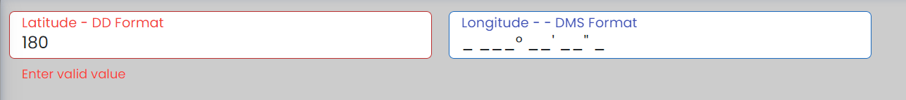

## Selector for dx-coordinates
`<dx-coordinates></dx-coordinates>`

## Module
`DxCoordinatesModule`
## Usage inside form
```
<form [formGroup]="form">
    <dx-coordinates [direction]="1" [coordinateFormat]="'DD'" formControlName="latitude">
        <dx-label>Latitude</dx-label>
    </dx-coordinates>
    <dx-coordinates [direction]="2" [coordinateFormat]="'DD'" formControlName="longitude">
        <dx-label>Longitude</dx-label>
    </dx-coordinates>
</form>
```   
## Usage for latitude and longitude combinated with one field
```
    <dx-latlong-input [(ngModel)]="value">
       <dx-label>Latitude</dx-label>
    </dx-latlong-input>
```

`**Note**: It is mandatory to use dxLabel Directive with element tag to display label outside field e.g: <div dxLabel>Name</div>` 
## Inputs

| Input  | Data need to be passed as input |
| ------------- | ------------- |
| **direction** (Direction) | `pass value 1 for latitude input or value 2 for longitude input`  |
| **coordinateFormat** ('DD' | 'DMS') | ` To display in DD or DMS coordinate format`  |
| **disabled** (boolean) | `pass boolean value to enable or disable field (default value false)`  |
| **noneLabel** (boolean) | `pass boolean value to enable or disable label (default value false)`  |
| **outline** ('floating' | 'none-floating' | 'outer-label')  | `To Change Outline of input (default value none-floating)` |
| **labelPosition** ('left' or 'top')  | `To Change Outer Label position   (default value top)` |
## Import CUSTOM_ELEMENTS_SCHEMA 

`import { CUSTOM_ELEMENTS_SCHEMA } from '@angular/core'`

>Include  **schemas: [CUSTOM_ELEMENTS_SCHEMA]** in module file if  **dx-label** and **dx-error**  gives error as they custom elements using as ng-content
     
  
          
        
      