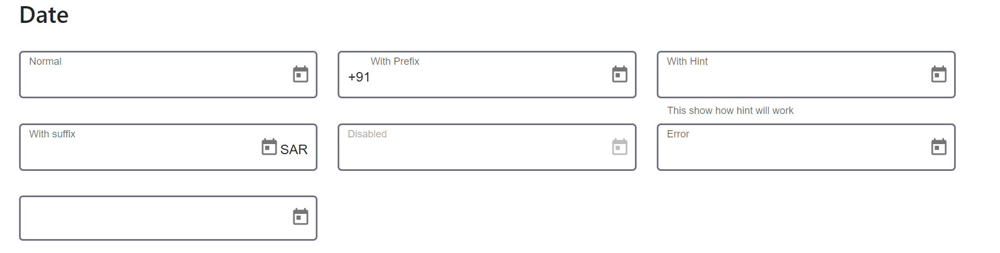

## Selector 
`<dx-datepicker></dx-datepicker>`

## Module
`DxDatepickerModule`
## Usage inside form
```
<form [formGroup]="userForm">
    <dx-datepicker [minDate]="minDate" [maxDate]="maxDate" formControlName="control">
        <dx-prefix></dx-prefix>
        <dx-label>Date Of Birth</dx-label>
         <dx-hint>
                This show how hint will work
            </dx-hint>
        <dx-suffix></dx-suffix>
        <dx-error *ngIf="userForm.controls['dob'].invalid && userForm.controls['dob'].errors &&  userForm.controls['dob'].touched">
            Please select valid Date</dx-error>
        </dx-datepicker>
</form>

```    
`**Note**: It is mandatory to use dxLabel Directive with element tag to display label outside field e.g: <div dxLabel>Date Of Birth</div>`
## Inputs

| Input  | Data need to be passed as input |
| ------------- | ------------- |
| **disabled** (boolean) | `pass boolean value to enable or disable field (default value false)`  |
| **maxDate** (Date) | `max Date `  |
| **minDate** (Date) | `min Date `  |
| **noneLabel** (boolean) | `pass boolean value to enable or disable label (default value false)`  |
| **required** (boolean) | `use required for mandatory fields `  |
| **formControlName** (string)  | `form control name of form group` |
| **labelPosition** ('left' or 'top')  | `To Change Outer Label position   (default value top)` |
## Import CUSTOM_ELEMENTS_SCHEMA 

`import { CUSTOM_ELEMENTS_SCHEMA } from '@angular/core'`


>Include  **schemas: [CUSTOM_ELEMENTS_SCHEMA]** in module file if  **dx-label**, **dx-hint**, **dx-suffix**,  **dx-prefix** and **dx-error**  gives error as they custom elements using as ng-content
     
  
     
          
          
        
      