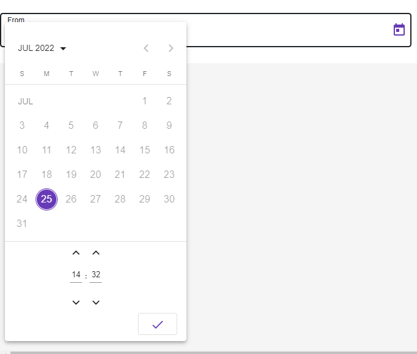

## Selector 
`<dx-datetime-picker></dx-datetime-picker>`

## Module
`DxDatetimePickerModule`
## Usage inside form
```
<form [formGroup]="userForm">
    <dx-datetime-picker [minDate]="minDate" [maxDate]="maxDate" formControlName="control" [showSpinners]="showSpinners" [showSeconds]="showSeconds"
        [stepHour]="stepHour" [stepMinute]="stepMinute" [stepSecond]="stepSecond" [touchUi]="touchUi"
        [color]="color" [enableMeridian]="enableMeridian">
        <dx-prefix></dx-prefix>
        <dx-label>Date Of Birth</dx-label>
         <dx-hint>
                This show how hint will work
            </dx-hint>
        <dx-suffix></dx-suffix>
        <dx-error *ngIf="userForm.controls['dob'].invalid && userForm.controls['dob'].errors &&  userForm.controls['dob'].touched">
            Please select valid Date</dx-error>
        </dx-datetime-picker>
</form>

```    
`**Note**: It is mandatory to use dxLabel Directive with element tag to display label outside field e.g: <div dxLabel>Date Of Birth</div>`
## Inputs

| Input  | Data need to be passed as input |
| ------------- | ------------- |
| **disabled** (boolean) | `pass boolean value to enable or disable field (default value false)`  |
| **maxDate** (Date) | `max Date `  |
| **minDate** (Date) | `min Date `  |
| **noneLabel** (boolean) | `pass boolean value to enable or disable label (default value false)`  |
| **required** (boolean) | `use required for mandatory fields `  |
| **formControlName** (string)  | `form control name of form group` |
| **labelPosition** ('left' or 'top')  | `To Change Outer Label position   (default value top)` |

#### List of @Input of dx-datetime-picker


| @Input        	| Type     	| Default value 	| Description                                                          	|
|---------------	|----------	|---------------	|----------------------------------------------------------------------	|
| **disabled**      	| boolean  	| null          	| If true, the picker is readonly and can't be modified                	|
| **showSpinners**  	| boolean  	| true          	| If true, the spinners above and below input are visible              	|
| **showSeconds** 	| boolean  	| true          	| If true, it is not possible to select seconds                        	|
| **disableMinute** 	| boolean  	| false          	| If true, the minute is readonly                        	|
| **defaultTime** 	| Array  	| undefined          	| An array [hour, minute, second] for default time when the date is not yet defined                        	|
| **stepHour**      	| number   	| 1             	| The number of hours to add/substract when clicking hour spinners     	|
| **stepMinute**    	| number   	| 1             	| The number of minutes to add/substract when clicking minute spinners 	|
| **stepSecond**    	| number   	| 1             	| The number of seconds to add/substract when clicking second spinners 	|
| **color**    	   | ThemePalette   	| undefined             	| Color palette to use on the datepicker's calendar. 	|
| **enableMeridian** | boolean   	| false             	| Whether to display 12H or 24H mode. 	|
| **hideTime** | boolean   	| false             	| If true, the time is hidden. 	|
| **touchUi**    	   | boolean   | false           | Whether the calendar UI is in touch mode. In touch mode the calendar opens in a dialog rather than a popup and elements have more padding to allow for bigger touch targets. 	|
| **defaultTime** | [hour, minute, second] | [] | Set Default Value for time

## Import CUSTOM_ELEMENTS_SCHEMA 

`import { CUSTOM_ELEMENTS_SCHEMA } from '@angular/core'`


## Custom Date Format

const CUSTOM_DATE_FORMATS: NgxMatDateFormats = {
  parse: {
    dateInput: 'l, LTS'
  },
  display: {
    dateInput: 'YYYY-MM-DD HH:mm',
    monthYearLabel: 'MMM YYYY',
    dateA11yLabel: 'LL',
    monthYearA11yLabel: 'MMMM YYYY',
  }
};

{
    provide: NgxMatDateAdapter,
    useClass: CustomNgxDatetimeAdapter,
    deps: [MAT_DATE_LOCALE]
},
{ provide: NGX_MAT_DATE_FORMATS, useValue: CUSTOM_DATE_FORMATS },


>Include  **schemas: [CUSTOM_ELEMENTS_SCHEMA]** in module file if  **dx-label**, **dx-hint**, **dx-suffix**,  **dx-prefix** and **dx-error**  gives error as they custom elements using as ng-content
     
  
     
          
