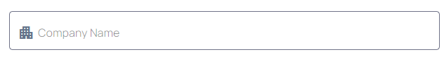

## Selector for dx-input-company
`<dx-input-company></dx-input-company>`

## Module
`DxInputCompanyModule`
## Usage inside form
```
<form [formGroup]="userForm">
    <dx-input-company (blur)="blur()"  disabled="false" formControlName="name">
            <dx-hint>
                This show how hint will work
            </dx-hint>
        <dx-suffix></dx-suffix>
            <dx-error  *ngIf="userForm.controls['name'].required && userForm.controls['name'].errors &&userForm.controls['name'].touched">Name is Required</dx-error>
            <dx-error  *ngIf="userForm.controls['name'].invalid">Enter valid name</dx-error>
    </dx-input-company>
</form>

```    
## Inputs

| Input  | Data need to be passed as input |
| ------------- | ------------- |
| **disabled** (boolean) | `pass boolean value to enable or disable field (default value false)`  |

| **noneLabel** (boolean) | `pass boolean value to enable or disable label (default value false)`  |
| **mask** (string) | `Pass your mask`  |
| **formControlName** (string)  | `form control name of form group` |
| **outline** ('floating' | 'none-floating' | 'outer-label')  | `To Change Outline of input (default value none-floating)` |
| **placeholder** (string)  | `pass placeholder to be displayed (default value - Name)` |
| **pattern** (string)  | `pass regex pattern to validate (default value - /^[A-Za-z]{2}/)` |
| **icon** (string)  | `pass icon to be displayed (default value - account_circle)` |

## Import CUSTOM_ELEMENTS_SCHEMA 

`import { CUSTOM_ELEMENTS_SCHEMA } from '@angular/core'`

>Include  **schemas: [CUSTOM_ELEMENTS_SCHEMA]** in module file if  **dx-label**, **dx-hint**, **dx-suffix**,  **dx-prefix** and **dx-error**  gives error as they custom elements using as ng-content
     
  
          
        
      