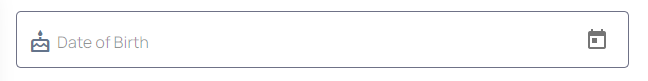

## Selector for dx-input-dob
`<dx-input-dob></dx-input-dob>`

## Module
`DxInputDOBModule`
## Usage inside form
```
<form [formGroup]="userForm">
    <dx-input-dob disabled="false" formControlName="dob" placeholder="DOB" [minDate]="minDate" [maxDate]="maxDate" icon="calendar_month">
            <dx-hint>
                This show how hint will work
            </dx-hint>
        <dx-suffix></dx-suffix>
            <dx-error  *ngIf="userForm.controls['dob'].required && userForm.controls['dob'].errors &&userForm.controls['dob'].touched">Dob is Required</dx-error>
            <dx-error  *ngIf="userForm.controls['dob'].invalid">Enter valid dob</dx-error>
    </dx-input-dob>
</form>

```    
## Inputs

| Input  | Data need to be passed as input |
| ------------- | ------------- |
| **disabled** (boolean) | `pass boolean value to enable or disable field (default value false)`  |
| **formControlName** (string)  | `form control dob of form group` |
| **outline** ('floating' | 'none-floating' | 'outer-label')  | `To Change Outline of input (default value none-floating)` |
| **placeholder** (string)  | `pass placeholder to be displayed (default value - Date of Birth)` |
| **icon** (string)  | `pass icon to be displayed (default value - cake)` |
| **minDate** (Date)  | `pass minDate for validation (default value - today's Date - new Date())` |
| **maxDate** (Date)  | `pass maxDate for validation` |
| **enableAgeValidator** (boolean)  | `Enable Custom Age Validator` |
| **dobConfig** (DobConfig)  | `Pass DobConfig to configure error message (eg.incorrect) and minimum age  (eg.18) (Applicable once` **enableAgeValidator** `is enabled)`|
## Import CUSTOM_ELEMENTS_SCHEMA 

`import { CUSTOM_ELEMENTS_SCHEMA } from '@angular/core'`

>Include  **schemas: [CUSTOM_ELEMENTS_SCHEMA]** in module file if  **dx-label**, **dx-hint**, **dx-suffix**,  **dx-prefix** and **dx-error**  gives error as they custom elements using as ng-content
     
  
          
        
      