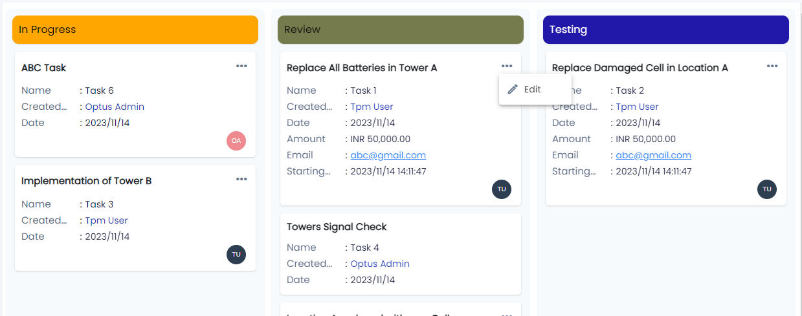

## Module
>` DxKanbanViewModule `

## Selector for dx-kanban-view
> ` <dx-kanban-view></dx-kanban-view>`

## Usage
> `
    <dx-kanban-view [dataSource]="dataSource" (onColumnChange)="onColumnChange($event)" (onSequenceChange)="onSequenceChange($event)"></dx-kanban-view>
` 
## Inputs

| Input  | Description |
| ------------- | ------------- |
| **dataSource** (KanbanViewModel) | ` Kanban View Data`  |

## Output
| Output  | Description |
| ------------- | ------------- |
| **onColumnChange** (KanbanBoardColumnChangeModel) | `The data for dropped cards is emitted (Whenever the card changes from one column to another )`  |
| **onSequenceChange** (KanbanBoardSequenceChangeModel) | `As you sort cards within a column, the sequence will be updated (On sorting cards within a column)`  |

## Final Output 
> **Note**: Output with sample data

  
          
        
      