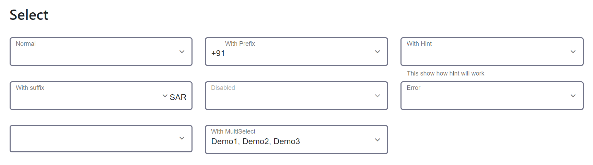

## Selector for dx-input
`<dx-select></dx-select>`

## Module 
`DxSelectModule`

## Usage inside form
```
<form [formGroup]="userForm">
    <dx-select (onSelectChange)="onSelectChange($event)" [options]="options" formControlName="country"
          disabled="false" multiSelect="true" required="true>
          <dx-prefix></dx-prefix>
        <dx-label>Label</dx-label>
        <dx-suffix></dx-suffix>
          <dx-hint>
          This show how hint will work
        </dx-hint>
        <dx-error 
       *ngIf="userForm.controls['country'].invalid && userForm.controls['country'].errors &&userForm.controls['country'].touched">
            Please select valid option
     </dx-error>
    </dx-select>
</form>

```    
## Inputs

| Input  | Data need to be passed as input |
| ------------- | ------------- |
| **disabled** (boolean) | `pass boolean value to enable or disable field (default value false)`  |
| **options** {KeyValueModel[]}  | `key value model return value will be` **keyTt**   |
| **formControlName** (string)  | `form control name of form group` |
| **multiSelect** (boolean)  | `select multiple options  (default value false)` |
| **required** (boolean)  | `if field is mandatory pass boolean value true (default value false)` |
| **noneLabel** (boolean) | `pass boolean value to enable or disable label (default value false)`  |
## Events

| Event  | Time of triggering |   return type |
| ------------- | ------------- |--------|
| **onSelectChange**  | `on selection of option`  | **OnSelectChange** |

## Import CUSTOM_ELEMENTS_SCHEMA 

`import { CUSTOM_ELEMENTS_SCHEMA } from '@angular/core'`

>Include  **schemas: [CUSTOM_ELEMENTS_SCHEMA]** in module file if  **dx-label**, **dx-hint**, **dx-suffix**,  **dx-prefix** and **dx-error**  gives error as they custom elements using as ng-content
     
  
     
          
          
        
      